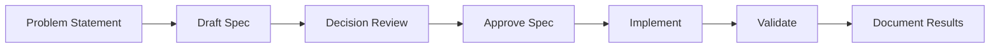

# Spec-Driven Workflow

This repository uses a lightweight spec-driven development flow optimized for fast AI-assisted implementation.

## Workflow stages

## Stage definitions

### 1) Problem statement
- Describe user/problem in 3-8 lines.
- Define measurable outcome.

### 2) Draft spec
- Use one template from `docs/specs/`.
- Include explicit acceptance criteria and constraints.

### 3) Decision review
- Record important choices in `product/decision-log.md`.
- Include alternatives and rejection reasons.

### 4) Approve spec
- Mark status as `approved`.
- Freeze scope for implementation.

### 5) Implement
- Implement minimal changes needed to satisfy the accepted spec.
- Keep architecture boundaries (ports vs adapters).

### 6) Validate
- Run impacted examples/tests/lint checks.
- Verify expected outputs and regression safety.

### 7) Document results
- Update spec with final status.
- Capture deviations and follow-up tasks.

## Required quality gate
A PR or change is blocked if any of the following is missing:
- problem statement
- acceptance criteria
- architecture impact
- validation plan

## Definition of done
A spec is done when:
- all acceptance criteria are met,
- validations pass,
- usage docs were updated,
- decision log entry exists for non-trivial design choices.
