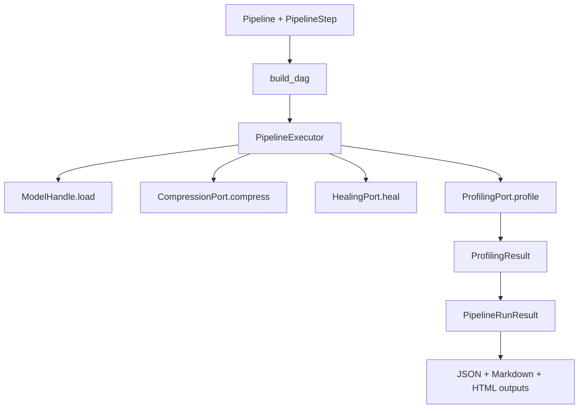
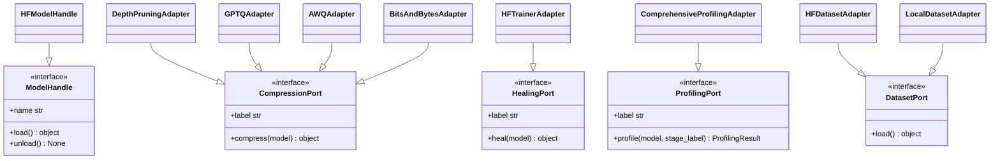
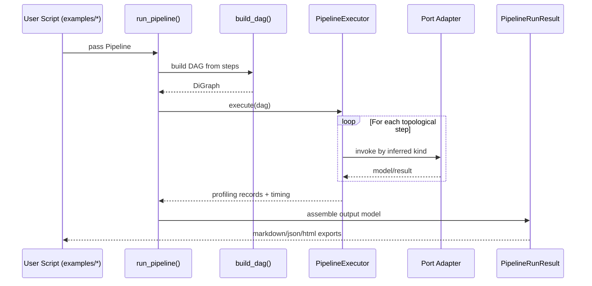

# Architecture

This document describes the current architecture with emphasis on extension boundaries and execution flow.

## High-level design

## Port/adapter class map

## Runtime sequence

## Architectural decision choices (technical)

### Choice A — Contract-first core
- Decision: `core/` defines contracts (`Port` interfaces + result schemas).
- Benefit: lower coupling and safer extension.
- Trade-off: adapters need explicit mapping logic.

### Choice B — Linear pipeline represented as DAG
- Decision: author linear steps, convert internally to DAG.
- Benefit: simple user authoring and deterministic order.
- Trade-off: no native branching today.

### Choice C — Structured result schema
- Decision: centralize measurements in `ProfilingResult` and `PipelineRunResult`.
- Benefit: reproducible exports and consistent reporting.
- Trade-off: schema changes must be managed carefully.

## Report template structure

- `llm_flux/core/html_reporter.py` remains the single Python entrypoint for HTML report generation.
- The Jinja entry template lives under `llm_flux/core/templates/report/` and is composed from partials grouped by concern.
- The render context passed from Python is intentionally kept stable during template-only refactors.
- Report partials must preserve section order, DOM ids/classes, and inline script execution order unless a spec explicitly allows behavior changes.

### Report template maintenance rules
- Add or refactor report sections by editing the smallest relevant partial under `llm_flux/core/templates/report/`.
- Prefer Jinja includes/macros for structural reuse; avoid moving report CSS/JS to external assets unless a new spec approves it.
- Keep compatibility-sensitive hooks unchanged:
  - DOM ids used by ECharts initialization
  - class names used by styling and conditional visibility
  - render-context variable names supplied by `llm_flux/core/html_reporter.py`
- When making non-trivial report template changes, update `docs/specs/` and `docs/product/decision-log.md` alongside the implementation.

## What to avoid
- Adding technique-specific behavior directly into `PipelineExecutor`.
- Bypassing ports with direct concrete type checks in unrelated modules.
- Returning unstructured dicts where canonical models exist.
